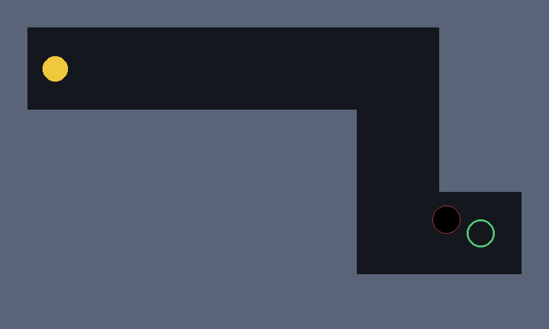

# fremarble

A Marble Madness-style tilt game for the **Nokia N900** (Maemo 5 "fremantle", 2009), whose
levels will be designed by a self-hosted language model that studies how the levels get
played. Semester project for PSAM 5600 B, *Small Linux Devices, Large Language Models*
(Parsons, Fall 2026).

- **Device:** Nokia N900, 600 MHz Cortex-A8, 245 MB RAM, 800×480 resistive touch, 3-axis
  accelerometer, vibrator. Python 2.5.4 + pygame 1.9.1 from the Maemo archival catalogues.
- **Model server:** free Oracle Ampere A1 node (4 cores, 24 GB, CPU only) running Ollama.
  The level designer will be `qwen3-coder:30b-a3b` there. Not wired in yet.
- **Co-authoring models** (each commit's trailer names who wrote it): Claude Fable 5.1
  (direction, bootstrap files, bug reports, this README), Claude Sonnet 5 via GitHub Copilot
  (level format and loader), GPT-5.4 mini via GitHub Copilot (game loop, telemetry, bot,
  physics). See `docs/model-probes/` for the raw model outputs and usage records.
- **Status:** prototype plays on the device. One hand-made level. A scripted bot clears it in
  about 10 s; a human has not cleared it yet.



## The idea

The N900 cannot run a language model, but it can be the hand, screen and sensor for one.
The game runs entirely on the device. A model on the cloud node designs level packs as plain
text files, and after each play session the game's telemetry goes back to the designer, so
the next pack is tuned by how the last one was actually played. Two players play every pack:
a **bot** (tilt injected from a file over SSH, screen read back from the framebuffer) and a
**human** holding the device. The gap between their telemetry is part of what the project
studies. The design dossier, with every measurement behind these choices, is
[`docs/fremantle-calling.html`](docs/fremantle-calling.html) (also published as a Claude
artifact, "Fremantle Calling").

## Running it on the N900

Prerequisites on the device (see the dossier for the full trail): `python2.5` and
`python-pygame` from the archival Extras catalogue, plus `libsdl-ttf2.0` from Nokia's own
"apps" catalogue, which the Extras index does not carry. Everything installs to `/opt`.

```
scp -r . root@<n900-ip>:/home/user/MyDocs/fremarble
ssh root@<n900-ip>
cd /home/user/MyDocs/fremarble
export DISPLAY=:0
python2.5 test_level.py                      # PASS: levels/001-first-tilt.lvl (First Tilt)
python2.5 game.py levels/001-first-tilt.lvl  # real accelerometer, 60 s limit
```

`game.py <level> [tilt_source] [telemetry_csv] [timeout_s]`. Hold the device the way you
want to play for the first half-second: that angle becomes "level". Reach the goal ring,
run out of time, or touch the screen to end. The last line printed is always
`RESULT outcome=... elapsed=... deaths=... par=... frames=... avg_fps=...`.

### Playing it with a bot

Tilt is read every frame from one file. Point the game at any file and something else can
write it:

```
echo "0 0 -1000" > /tmp/tilt
python2.5 game.py levels/001-first-tilt.lvl /tmp/tilt telemetry/bot.csv 30 &
python2.5 bot_tilt.py /tmp/tilt "0,0,-1000:3;-300,0,-800:3;150,-300,-800:3;-300,-150,-800:3;150,100,-800:1.5;0,0,-1000:3"
```

Each script segment is `x,y,z:seconds` in milli-g, rewritten every 100 ms, in the device's own
axes: x runs along the long side of the screen (x = -300 rolls the marble right), y along the
short side (y = -300 rolls it down). The first segment holds the device level while the game
calibrates. That script reaches the goal of level 001 in about 12 s. To see the screen from the laptop:
`cat /dev/fb0 > fb.raw` on the device (RGB565, 4096-byte stride, 480 rows), then convert.
Taking the grab drops play to about 8 fps while it runs, so grab between levels.

## Files

| Path | What | Written by |
|---|---|---|
| `game.py` | game loop, physics, haptics | GPT-5.4 mini |
| `level.py`, `test_level.py`, `levels/FORMAT.md` | `.lvl` format, loader, validator | Claude Sonnet 5 |
| `levels/001-first-tilt.lvl` | the first level | Claude Sonnet 5 |
| `telemetry.py` | 10 Hz CSV writer | GPT-5.4 mini |
| `bot_tilt.py` | scripted tilt writer | GPT-5.4 mini |
| `tools/marble_fps.py` | the frame-rate test that decided Python was fast enough | Claude Fable 5.1 |
| `tools/tilt_axes.py` | prints which way the marble would roll from the live sensor | Claude Fable 5.1 |
| `telemetry/` | every run so far, bot and human | the device |
| `docs/TASK*.md`, `docs/BUG-00*.md` | the specs the models were given, and the two bug reports | Claude Fable 5.1 |
| `docs/model-probes/` | raw model outputs, usage files, the seven-model comparison | the models |
| `.github/copilot-instructions.md` | the Python 2.5 bootstrap every model gets | Claude Fable 5.1 |

## Known behaviour

- **A human has not finished level 001, and until 2026-09-07 could not have.** The accelerometer
  axes were transposed (BUG-002): a left/right tilt moved the marble up/down. Play-test 1 (old
  physics): 120 s, 7 deaths. Play-tests 2 to 6 (tuned physics): every one ended by a screen touch
  inside the first corridor, and in every one the player's left/right tilt pointed the way the
  marble should have gone and did not. The mapping is fixed; the feel with correct axes is untested
  by a hand. Run `python2.5 tools/tilt_axes.py` over SSH and tilt: it must say RIGHT when the right
  edge goes down and DOWN when the bottom edge does.
- **Physics were tuned once**, from telemetry, not from a hand on the device: 1.2 px/s² per
  milli-g, 0.8/s drag, 900 px/s cap, 0.3 wall restitution, 40 mg soft dead zone (subtracted, not
  stepped), 3-sample smoothing. All constants are at the top of `game.py`.
- **The bot must hold the device level for the first half second.** The game averages the first
  0.5 s of tilt as "level"; pygame takes over a second to start on the device, so a script that
  begins tilting at once gets its first segment calibrated away. Lead with `0,0,-1000:3`.
- **Holes swallow the marble's centre**, not its edge. Walls buzz the vibrator on hard hits.
- **Empty-string arguments are taken literally.** Pass a real path or omit the argument.
- **The device's clock is wrong** (it thinks it is 2009), so default telemetry filenames carry
  bad timestamps. Pass a path.
- **No model designs levels yet.** That is the next milestone.

## Attribution and transcripts

Every commit carries a `Co-Authored-By:` trailer for the model that wrote its lines, per the
course's [ATTRIBUTION.md](https://github.com/mfadt/sld-fall-2026/blob/main/ATTRIBUTION.md).
Raw model outputs are in `docs/model-probes/` with Copilot's usage files beside them. The
rule that governs the collaboration: models emit bytes; only the student moves bytes onto
the device, and owns what happens there.

## License

MIT. Chosen because the course's own materials are MIT, the Maemo community packages this
depends on are permissively licensed, and a game for a discontinued handheld is more useful
copied than protected.
